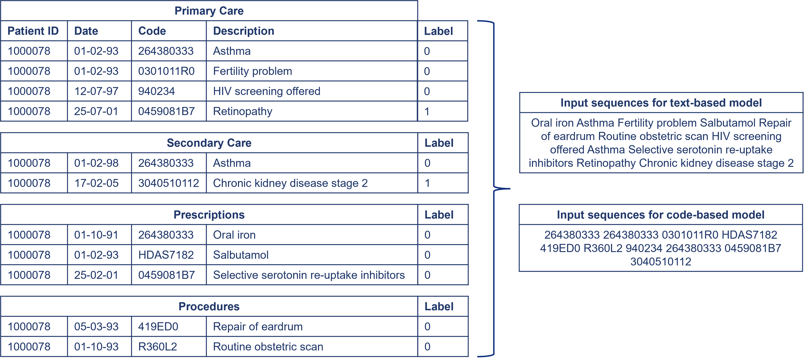

# ML4H-diabetes-complications
This repository contains the code for the workshop paper *Exploring Long-Term Prediction of Type 2 Diabetes Microvascular Complications* (Machine Learning for Healthcare 2024).

## The challenge
Healthcare data is often stored in different places using different clinical code ontologies, such as the International Classification of Diseases (ICD) or Systematized Nomenclature of Medicine-Clinical Terms (SNOMED-CT). In order to analyse the data this requires mapping between these coding systems, which can result in a loss of data. In this paper we explore the effectiveness of code-agnostic models which mediates the need for mapping.

## Prepare your data 
This paper compared two input types, text versus medical codes. For the text-based approach, we order the events (diagnosis, medication or procedure) for each patient chronologically and then concatenate the textual descriptors into a sentence. For the medical code approach, we do the same but concat the medical codes into a sequence. See image below for an example.

*Input format for text and code approaches*

## Model 
